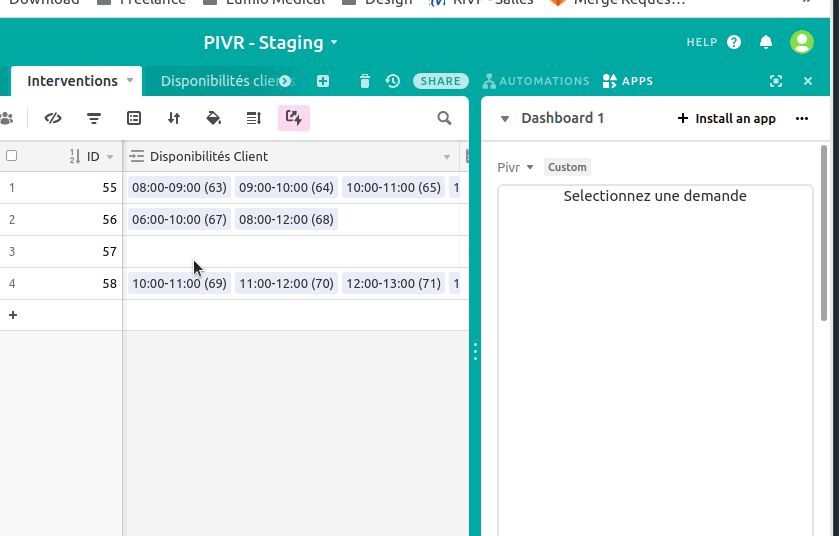

# PIVR - Appointment slot selector- Airtable App

This is a React App integrated into Airtable.

# Installation

If you want to try it yourself you need an Airtable base setup like this :

- Table `Disponibilités clients`

  - Field `Intervention` linked to table `Interventions`
  - Field `Date début` (date)
  - Field `Date fin` (date)

- Table `Interventions`
  - Field `Disponibilités clients` linked to table `Disponibilités clients`
  - Field `Créé à` (created at)

Then follow this tutorial to add the custom app : https://airtable.com/developers/apps/guides/getting-started

# Demo

